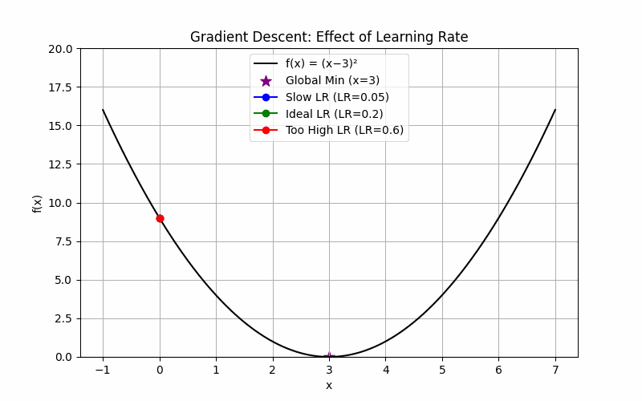

# 👋 Hi there, I'm Manav Malhotra

)

---

🎓 **B.Tech CSE (CBSE)** @ Thapar Institute of Engineering & Technology (TIET'25)  
🧠 Passionate about **Grey-Box AI** — Bridging Deep Learning & Domain Knowledge  
🧪 Research Interests:  
&nbsp;&nbsp;&nbsp;&nbsp;🔬 Scientific ML | 🧮 Physics-Informed Neural Networks (PINNs) | 🧠 Biomedical AI  
📄 **IEEE & Scopus-Indexed Author** | 🧑‍🏫 UGC-NET Qualified (PhD Eligibility)

> 🧰 Crafting neurons that think beyond data: shifting towards domain principles  
> 💡 Towards AI that’s **interpretable, applicable, and impactful**

---
### 👨‍💻 Programming & ML

### 🌐 Web & Backend

### 🧪 Data, Visualization, Cloud

---

## 💻 IDEs & Editors

---

## 📝 Current Interests

- 🚀 **Inverse PINNs** — Estimating hidden parameters from physical observations.
- 📊 **Grey-Box AI Guide** — A beginner-friendly guide to physics-informed and domain-aware ML.
- 🧠 **Biomedical Modeling** — Combining clinical insights with computational modeling.

## 📉 Learning Matters...

### 🤝 Let's Collaborate
If you’re working on **interpretable AI**, **PINNs**, or **biomedical data modeling**, let’s connect!

